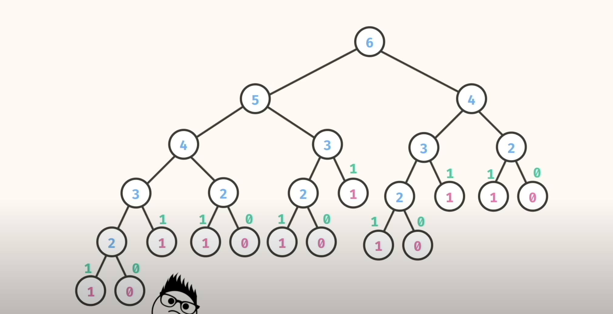

# Dynamic Programming
It's a type of problem solving where we use the overlapping sub-problem
We first solve and store the info the solutionn to the sub-problem because we are likely to
re-encounter it again

1. Fibonacci
0 1 1 2 3 5 8 13 21 .....

Formalize the  problem:
n     : 0 1 2 3 4 5 6 7  8  .....
fib(n): 0 1 1 2 3 5 8 13 21 .....

**Solving the fibonacci recursively**
fib(6) -> 8
fib(6) -> fib(5) + fib(4) 

Every node in the diagram represents a recursive call.
The number of nodes roughly represents the time complexity
*Space complexity for recursion is the number of **stack frames*** we use for our recursion because  whenever we make a recursive call, that information has to be stored in the call stack
 
We use memoization strategy - store info in a hashed data structure (hashmap, dictionary...etcm ). Use a data structure that gives an O(1) lookup time
In recursion, there may be duplication of results. We thus store the results. This is memoization
The keys are usually the changing arguments of your recursion problem.